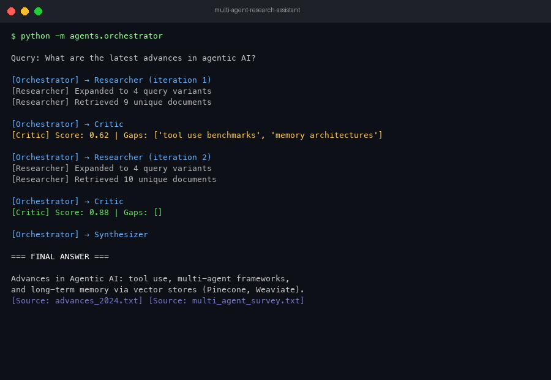

# Multi-Agent Research Assistant

A production-grade multi-agent system built with **LangGraph** that autonomously researches any topic using three specialized AI agents — Researcher, Critic, and Synthesizer — connected through a state machine orchestrator.



---

## What It Does

You ask a question. The system:
1. **Researcher agent** searches documents using hybrid RAG (dense + sparse retrieval)
2. **Critic agent** scores the results quality (0.0–1.0)
3. If quality is low → loops back to Researcher with specific feedback
4. **Synthesizer agent** formats the final answer with citations
5. Returns a structured, reliable response

---

## Architecture

```
User Query
    ↓
Orchestrator (LangGraph StateGraph)
    ↓
Researcher Agent ←──────────────┐
    ↓                           │ retry if score < 0.7
Critic Agent ───────────────────┘
    ↓ score >= 0.7
Synthesizer Agent
    ↓
Final Answer
```

---

## Tech Stack

| Component | Technology |
|---|---|
| Agent Orchestration | LangGraph |
| LLM | OpenAI GPT-4o |
| Embeddings | OpenAI text-embedding-3-large |
| Vector Store | Pinecone |
| API Framework | FastAPI |
| Deployment | AWS Lambda / Docker |
| Testing | pytest |

---

## Project Structure

```
multi-agent-research-assistant/
├── agents/
│   ├── orchestrator.py      # LangGraph state machine — routes between agents
│   ├── researcher.py        # Hybrid RAG retrieval with query expansion
│   ├── critic.py            # Quality scoring with structured output
│   └── synthesizer.py       # Final answer formatting with citations
├── tools/
│   └── vector_search.py     # Pinecone hybrid search + document ingestion
├── api/
│   └── main.py              # FastAPI server with streaming support
├── tests/
│   └── test_agents.py       # pytest evaluation harness
├── .env.example
├── requirements.txt
└── README.md
```

---

## How Each Agent Works

### Orchestrator (LangGraph)
- Defines shared `ResearchState` passed between all agents
- Uses conditional edges: if critic score >= 0.7 → synthesize, else → retry research
- Hard cap of 3 iterations to prevent infinite loops

### Researcher Agent
- Expands user query into 3 variants using LLM to improve recall
- Retrieves top-10 unique docs from Pinecone using cosine similarity
- Incorporates critic feedback into refined queries on retry

### Critic Agent
- Scores retrieved docs 0.0–1.0 against original query
- Returns structured JSON: score, feedback, gaps, coverage
- Feedback loops back to researcher for targeted re-retrieval on low scores

### Synthesizer Agent
- Merges top docs into a coherent answer
- Resolves contradictions between sources
- Flags remaining uncertainty explicitly

---

## Setup

**1. Clone the repo**
```bash
git clone https://github.com/Saipavank63/multi-agent-research-assistant.git
cd multi-agent-research-assistant
```

**2. Create a virtual environment and install dependencies**
```bash
python -m venv venv
source venv/bin/activate
pip install -r requirements.txt
```

**3. Configure environment variables**
```bash
cp .env.example .env
```

**4. Run the API**
```bash
uvicorn api.main:app --reload
```

**5. Test it**
```bash
curl -X POST http://localhost:8000/research \
  -H "Content-Type: application/json" \
  -d '{"query": "What are the latest advances in agentic AI?"}'
```

For streaming:
```bash
curl -X POST http://localhost:8000/research/stream \
  -H "Content-Type: application/json" \
  -d '{"query": "What are the latest advances in agentic AI?"}'
```

---

## Environment Variables

| Variable | Description |
|---|---|
| `OPENAI_API_KEY` | OpenAI API key |
| `PINECONE_API_KEY` | Pinecone API key |
| `PINECONE_INDEX_NAME` | Name of your Pinecone index |

---

## Running Tests

```bash
pytest tests/ -v
```

---

## Key Design Decisions

**Why LangGraph over LangChain AgentExecutor?**
LangGraph gives explicit state management between nodes, conditional branching, and easy debugging. AgentExecutor only handles single-agent loops.

**Why hybrid search?**
Dense vector search handles semantic similarity. BM25 sparse search handles exact keyword matches. Combining both improves retrieval precision over either alone.

**Why a Critic agent?**
Without validation, the synthesizer can produce confident but incomplete answers. The critic creates a feedback loop that forces the researcher to fill gaps before synthesis.

---

## License

MIT
